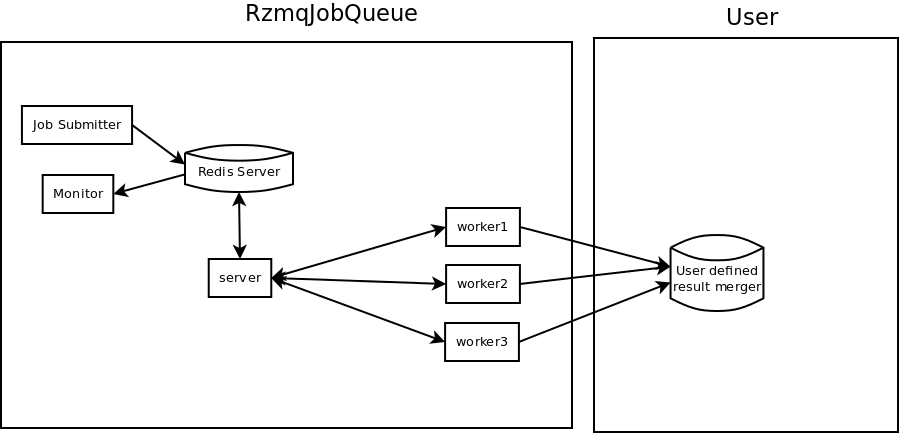

# RzmqJobQueue

RzmqJobQueue is a JobQueue system for R based on [redis](http://redis.io/) and [rzmq](http://cran.r-project.org/web/packages/rzmq/index.html)

# Structure



# Features

- Job Queue
- Worker can be plugged or unplugged without effecting the Job Queue
- Experimental
- With a [shiny](http://www.rstudio.com/shiny/) app to monitor the job queue

# Installing

I only use it under *Ubuntu*.

- Install `libzmq-dev`
- Install following R packages from CRAN:
    - log4r
    - rzmq (>= 0.6.1)
    - digest
    - rredis
    - Rcpp
- Set up a redis server. In ubuntu, just `apt-get install redis-server`.

# Quick Start

## Push *Job*s to Job Queue

```
library(RzmqJobQueue)
init_server(redis.flush=TRUE) # WARNING: it will FLUSH the redis server with index 1
set_init_job( new("job", fun=function() { # some init scripts here
}))
push_job_queue( new("job", fun=base:::mean, argv=list(x = rnorm(100))) )
```

## Start a Listener

```
#! /usr/bin/Rscript
library(RzmqJobQueue)
init_server(redis.flush=FALSE)
wait_worker(path="tcp://*:12345")
```

## Spawn Several Workers

```
#! /usr/bin/Rscript
library(Rbridgewell)
init_worker("tcp://localhost:12345")
while(TRUE) {
  do_job("tcp://localhost:12345")
  system(sprintf("rm %s/*", tempdir()))
}
```

## Monitor

```
library(shiny)
runApp(system.file("shiny", package="RzmqJobQueue"))
```